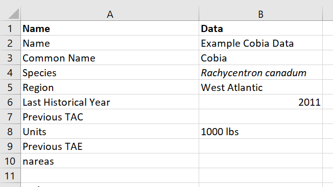

```{r setup, include=FALSE}
knitr::opts_chunk$set(echo = TRUE)
```

# Introduction
In this context, fishery data includes any information that can be used for one 
of three purposes:

1. to estimate the status of an exploited stock (e.g., stock assessment or a similar analysis), 
2. to condition an operating model (OM) for evaluating the performance of alternative management 
approaches using closed-loop simulation testing (e.g., Management Strategy Evaluation; MSE)
3. to be used by a management procedure (MP) to provide management advice.

This document describes the standardized fishery data format for the DLMtool and MSEtool R packages, and the browser-based interface for these packages: *MERA*.

Using a standardized format for fishery data has the advantage that a the data can easily be
applied for these three purposes without any requiring any re-organizing of the fishery data.

For example, the data file described in this document can be imported in MERA (or 
the R packages) and used to:

1. estimate stock status with the 10+ stock assessment methods,
2. condition an operating model for quantitative risk assessment or MSE,
3. provide management advice from the 100+ available management procedures.


## Data Files
There are two input files for the fishery data: a data input file and a data documentation file.

Once imported into MERA, the two files are combined to provide a report document including the contents of the documentation file and graphical display of the quantitative data in the data input file. 

### Data Input File
The Data Input File is a standardized file format for fishery data that uses a standardized spreadsheet format: either a CSV (comma separated file; file extension .csv') or a MS Excel file (file extension .xlsx or .xls). Support for Google Sheets may be added later. 
Users enter all available fishery data into the data input file, which can then be 
imported into the R packages or MERA and used for the variety of purposes described 
above.

### Data Documentation File
The Data Documentation file is a companion document that contains supporting information for the quantitative data in the input file. For example, the data documentation file can include a written description of the sources of the various data, the methods used to obtain the data, and relevant references to data sources or other information relating to the data preparation.

The Data Documentation file can be opened in any ordinary text editor (e.g., Notepad, Wordpad, or MS Word). It must be saved as an ordinary text file with extension '.md' (i.e., do not save as '.doc' or '.docx').

We suggest having the Data Input and Data Documentation files both open and documenting the data sources in the Documentation file while entering the quantitative data in the Input file.

The Data Documentation file uses the Markdown text formatting syntext. This means that all entries should be plain text. Markdown is very powerful, and it is straightforward to include additional formating such as equations, bullet points, or ordered lists. See the [Markdown cheat sheet](https://guides.github.com/pdfs/markdown-cheatsheet-online.pdf) for more information.

It is not necessary to be familiar with Markdown to enter information in the Data Documentation file. The main thing to be aware of is that headings are indicated with the # symbol; for example '#' is a first level heading, '##' is a second level heading, and so on.


## Templates
Templates for the Data Input and Data Documentation files can be downloaded from an online repository.

- [Data Input Excel File](https://raw.githubusercontent.com/DLMtool/DLMtool/master/inst/Data.xlsx) ^[https://raw.githubusercontent.com/DLMtool/DLMtool/master/inst/Data.xlsx]
(or [Data Input CSV File](https://raw.githubusercontent.com/DLMtool/DLMtool/master/inst/Data.csv) ^[https://raw.githubusercontent.com/DLMtool/DLMtool/master/inst/Data.csv])

- [Data Documentation File](https://raw.githubusercontent.com/DLMtool/DLMtool/master/inst/Rmd/Data/Data.md) ^[https://raw.githubusercontent.com/DLMtool/DLMtool/master/inst/Rmd/Data/Data.md]

Note that the links to the Data Input CSV File and Data Documentation File will open in the web browser. Save these files to your machine (usually by right-clicking in the browser) will file extensions '.csv' and '.md' respectively.

If using the DLMtool or MSEtool R packages in a R session, the template files can be generated by typing the following commands in the R console:

```{r, eval=FALSE}
library(DLMtool)
DataInit("Example") # create example populated Input and Documentation files 
# or create blank templates:
DataInit("MyDataFile") 
# replace "MyDataFile" with the name of the data files you wish to create
```

# Populating the Fishery Data Files
This section of the guide describes how to enter data in the Data Input file and document the data in the Data Documentation file.

**Important Note 1:** It is important to note that, in most cases, the data input file allows only one entry for each data type. For example, multiple catch-at-age data sets may be available (e.g., from a commercial fishery and from a fishery-independent survey). However, to be used in stock assessment or analysis, the two data sets must be combined in some way (or one data set ignored if it is not considered representative or reliable). 
Consequently, the data included in the Data Input file must represent the best available data. That is, the data sets must be combined in some manner (ideally described in the Data Documentation File) and the single data set entered into the data input file so it can be used in assessment or by management procedures.

This same principle applies to other data entered into the data input file. The only exception is for indices of abundance where multiple indices are allowed. This is explained in more detail in later sections of this guide.

**Important Note 2:** It is important that the text in the first column of the input file (column A) is not modified at all. These names are used to import the data file into MERA or the R packages.

**Important Note 3:** The data input file requires both character string (i.e., text) and numeric inputs. The data format for each entry is described below. It is important that no text is entered into the entries that require numeric inputs. For example, "Previous TAC" is a numeric input. A value of '1000' (without the quotations) is acceptable, while an input of 'about 1000' is not. 

**Important Note 4:** Do not use any thousands separators. For example 1 000 000 and 1,000,000 may introduce errors during the data import. Entries like 1000000 are preferable. 

The fishery data are grouped into 7 categories:

1. Metadata
1. Biological parameters
1. Selectivity parameters
1. Time-series information
1. Catch-at-age data
1. Catch-at-length data
1. Reference points and other metrics

The Data Documentation file has seven headings (indicated with the ## symbols) that correspond to these 7 categories. Do not delete or modify these headings. Enter all documentation under the relevant section in the Data Documentation file.

The first three lines of the Data Documentation file ask for information on the *title*, *author*, and *date*. Replace all text after the ":" symbol with the relevant information. Do not delete or modify the text  *title*, *author*, and *date*.

The following sub-sections describe the data inputs for each of data category. 

## Metadata
The metadata section has 9 entries (see Figure \@ref(fig:metadata) for example). All entries must go in the second column (column B if using a spreadsheet program such as MS Excel). 

```{r metadata, echo=FALSE, fig.cap="Example Metadata entries in the Data Input file"}

```

The *Metadata* section in the Data Documentation file is indicated with "## Metadata". Enter any relevant supporting information for the information in the Metadata section of the input file here. 

Use in-text citations where possible and include references under the "## Reference List" section.

Do not delete or modify the "## Metadata" heading.


### Name
Text entry. A unique name for this data file. 

### Common Name
Text entry. The common name of the species. 

The example data file is for data from a fishery for cobia.

### Species
Text entry. The scientific name of the species. 

The example data file includes the species name for cobia.

### Region
Text entry. The region of the fishery. 

The example data file assumes the fishery is in the Western Atlantic.

### Last Historical Year
Numeric entry. The calendar year of either:

1. when the most recent time-series data was collected, or
2. in cases where an MSE has already been conducted for this species and new data has been collected since,
the last historical year when the MSE was run. For example, if an MSE was conducted for this fishery in 2016 and new data has been collected since then, the last historical year is 2016.

The last historical year was 2011 in the example (Figure \@ref(fig:metadata)).

### Previous TAC
Numeric entry. The most recent total allowable catch (TAC). Leave blank if no TAC exists. 

There was no existing TAC for the example cobia fishery. 

### Units 
Text entry. The units of the TAC and catch data, e.g., 'thousand tonnes'. Leave blank if no TAC or catch data exists.

The catch data in the example fishery is in units of '1000 lbs'.

### Previous TAE
Numeric entry. The most recent total allowable effort limit (TAE). Leave blank if no TAE exists.

There was no existing TAE for the example cobia fishery. 

### nareas 
Numeric entry. The number of spatial areas used in management. Only used for management procedures that set spatial closures.
Leave blank if no spatial management is used or proposed. Don't enter 0 or 1.

The default value is 2 areas, which will be used if no value is entered here. 

There is no spatial management for the example cobia fishery. 

## Biology
The next section contains mean and uncertainty values for the biological parameters of the species. Leave any entry blank if the parameter is unknown.

```{r biology, echo=FALSE, fig.cap="Example Biology entries in the Data Input file"}
knitr::include_graphics("Figures/biology.png")
```

The *Biology* section in the Data Documentation file is indicated with "## Biology". Enter any relevant supporting information for the information in the Biology section of the input file here. 

Ideally a short paragraph or two with supporting information for each type of biological data entered in the Data Input file.

Use in-text citations where possible and include references under the "## Reference List" section.

Do not delete or modify the "## Biology" heading.


### Maximum age
Numeric entry. The maximum age of the species. The catch-at-age data entries must match this value (see the [Catch-at-Age] section for more details).

The cobia example has a maximum age of 16 (Figure \@ref(fig:biology)).

### M and CV M
Numeric entries. A point estimate for the (adult) natural mortality rate (*M*) and a coefficient of variation (CV) associated with this estimate (assuming a log-normal distribution).

The cobia example has an estimate of *M* of 0.26 and an associated CV of 0.3 (Figure \@ref(fig:biology)).

### von Bertalanffy Linf parameter and CV
Numeric entries. The estimated mean asymptotic length from a fitted von Bertalanffy growth model and the associated CV. 

The units of the *Linf* parameter are not important, but all length parameters and data (e.g., length-at-maturity and catch-at-length) must be in the same units.

The cobia example has an estimate of *Linf* of 1324.4 and an associated CV of 0.23 (Figure \@ref(fig:biology)).

### von Bertalanffy K parameter and CV
Numeric entries. The estimated von Bertalanffy growth parameter (*K*) and the associated CV. 

The *K* parameter must be in the same units as *M*, usually $\text{year}^{-1}$.

The cobia example has an estimate of *K* of 0.27 and an associated CV of 0.07 (Figure \@ref(fig:biology)).

### von Bertalanffy t0 parameter and CV
Numeric entries. The estimated age when mean length is zero (*t0*) and the associated CV. 

The *t0* parameter must be in the same units as "Maximum age" (usually years).

The cobia example has an estimate of *t0* of -0.47 and an associated CV of 0.05 (Figure \@ref(fig:biology)).

### Length-weight parameters
Numeric entries. Estimates of the *a* and *b* parameters (and associated CVs) from a fitted length-weight model of the form:

$$ W=aL^b$$

This data is not available for the example cobia data (Figure \@ref(fig:biology)). 

### Recruitment parameters
Numeric entries. Mean estimates and associated CVs.

The *steepness* parameter is the expected fraction of virgin recruitment when the spawning 
biomass has been reduced to 20% of the unfished level. This is an important parameter for determining the productivity of the stock, especially at low levels of spawning biomass. However, the parameter is difficult to estimate and not well known for many species.

The *sigmaR* parameter describes the variance around the expected stock-recruitment relationship. 

This data is not available for the example cobia data (Figure \@ref(fig:biology)). 

### Length-at-Maturity parameters
Numeric entries. Mean estimates and associated CVs.

The *Length at 50% maturity* and *Length at 95% maturity* parameters are estimated by fitting a logistic model to maturity-at-length data. The parameters refer to the expected length where 50% and 95% respectively of the population are mature. The CV of length at 95% maturity is assumed to be the same as the CV of length at 50% maturity.

The example cobia data has estimates of the length at 50% and 95% maturity of 644 and 850 mm respectively, and a CV of 0.05.

### Variability of length-at-age
Numeric entry. The expected variability of length-at-age; that is, the distribution of length-at-age around the mean growth curve described by the von Bertalanffy growth model. 

The example cobia data assumed a coefficient of variability of length-at-age of 0.1.


## Selectivity
There are five parameters relating to selectivity at length. Leave any entry blank if the parameter is unknown.

```{r selectivity, echo=FALSE, fig.cap="Example Selectivity entries in the Data Input file"}
knitr::include_graphics("Figures/selectivity.png")
```

The *Selectivity* section in the Data Documentation file is indicated with "## Selectivity". Enter any relevant supporting information for the information in the Selectivity section of the input file here. 

Ideally a short paragraph or two with supporting information for data entered in the Data Input file for the selectivity parameters.

Use in-text citations where possible and include references under the "## Reference List" section.

Do not delete or modify the "## Selectivity" heading.

### Length at first capture
Numeric entries. 

The *Length at first capture* is an estimate of first length class that is vulnerable to the fishery (and the associated CV).

The example cobia data file assumes a length of first capture of 130 and a CV of 0.2 (Figure \@ref(fig:selectivity)). 

### Length at full selection
Numeric entries. 

The *Length at full selection* is the first length class that is fully vulnerable to fishing (and the associated CV).

No information is available for the length at full selection for the example cobia data file (Figure \@ref(fig:selectivity)). 

### Vulnerability at asymptotic length
Numeric entry. 

The *Vulnerability at asymptotic length* describes that shape of the selectivity curve. Dome-shaped selectivity patterns (Vulnerability at asymptotic length < 1) occurs vulnerability to fishing begins to decrease after reaching a maximum value at some intermediate length.

The example cobia data file assumes asymptotic selectivity (Vulnerability at asymptotic length = 1) (Figure \@ref(fig:selectivity)). 

## Time-Series
The time-series section includes data sources such as annual catches, annual abundance indices, and other annual indices such as recruitment, and mean length. 

The *Time-Series* section in the Data Documentation file is indicated with "## Time-Series". Enter any relevant supporting information for the information in the Time-Series section of the input file here. 

Ideally a short paragraph or two with supporting information for data entered in the Data Input file for the Time-Series data.

Use in-text citations where possible and include references under the "## Reference List" section.

Do not delete or modify the "## Time-Series" heading.

```{r ts1, echo=FALSE, fig.cap="Example Time-series entries in the Data Input file"}
knitr::include_graphics("Figures/timeseries1.png")
```

```{r ts2, echo=FALSE, fig.cap="Example time-series entries in the Data Input file showing the entries continuing to the last historical year (2011)"}
knitr::include_graphics("Figures/timeseries2.png")
```

Time-series data should be entered for all historical years of the fishery; that is, the first year the fishery began to the current year of data (Figures \@ref(fig:ts1) and  \@ref(fig:ts2)). Years where no data are available should either be left empty or populated with an 'NA' (no quotations).

### Year
Numeric entry. The calendar years the fishery has been operating. The years should begin in the first year of the fishery and sequentially increase to the last year where time-series data is available. This is usually the same as the [Last Historical Year], unless more data has been collected since an MSE was conducted in the [Last Historical Year].

In the cobia example, the fishery began in 1950 (Figure \@ref(fig:ts1)) and time-series data exists until 2011 (Figure \@ref(fig:ts2)).

### Annual Catch and CV {#catches}
Numeric entries.

Total catch records for each year (NA for missing years) in the same units as [Units] and [Previous TAC]. 

CVs for each catch record should be included in the *CV Catch* row.

In the cobia example, we have catch records for every year, but no information on the CVs associated with these catches (Figures \@ref(fig:ts1) and \@ref(fig:ts2)).

### Annual Effort and CV
Numeric entries.

Data on the annual total fishing effort and associated annual CVs. Effort can either be in absolute units (e.g., days at sea) or a relative trend in effort (e.g., ranging from 0 to 1). However, the effort data should be in the same units as [Previous TAE] (if available).

Leave blank or use NA for missing years. 

There is no information on fishing effort for our cobia example (Figure \@ref(fig:ts1)).


### Abundance Index and CV {#abundance-index}
Numeric entries.

Relative or absolute annual index of total abundance and associated CVs. Leave blank if no data exists or use NA for years where data is missing.

The abundance index for the cobia example data set begins in 1981. All years before this are NA. There is no information on CV of the abundance index for the cobia example (Figures \@ref(fig:ts1) and  \@ref(fig:ts2)).

### Additional Indices
Numeric entries.

The additional indices are optional, and are used in cases where multiple indices of abundance exist and are used either in combination or separately by management procedures. 

There is no limit to the number of additional indices that can be added. The Data Input template has space for two additional indices (shaded in grey to indicate they are optional; Figure \@ref(fig:ts1)). 

Additional indices can be added by inserting 3 new rows for each additional index, with names in Column A following the form (ensure there are no spaces before or after the text):

1. Index #
1. CV Index #
1. Vuln Index #

where # is a sequentially increasing integer for each additional index.

The data for the additional indices follows the same form as [Abundance Index and CV]. The only additional piece of information is the new row for the vulnerability schedule associated with the new index. 

The vulnerability schedule for each index (e.g., *Vuln Index 1*) must be of length [Maximum age] and contain the vulnerability-at-age schedule associated with each index; i.e., values ranging from 0 to 1 indicating the vulnerability of each age-class that is represented in the additional index.

There are no additional indices for the example cobia dataset. 

### Recruitment Index and CV
Numeric entries.

Estimates of annual age-1 recruitment and associated CVs. 

Leave blank if no data exists, or use NA to indicate years where data are missing.
Must be the same length at [Year].

There is no data on annual recruitment for the example cobia dataset.
### Mean Length
Numeric entry.

Annual estimates of mean length of the vulnerable population (or catch). 

Leave blank if no data exists, or use NA to indicate years where data are missing.
Must be the same length at [Year].

There is no data on annual mean length for the example cobia dataset.

### Modal Length (LC)
Numeric entry.

Annual estimates of modal length of the vulnerable population (or catch). This is often used to assume the first length class 
of full selection.

Leave blank if no data exists, or use NA to indicate years where data are missing.
Must be the same length at [Year].

There is no data on annual modal length for the example cobia dataset.

### Mean Length above Lc
Numeric entry.

Annual estimates of mean length *above the modal length (Lc)* of the vulnerable population (or catch). 

Leave blank if no data exists, or use NA to indicate years where data are missing.
Must be the same length at [Year].

There is no data on annual mean length above Lc for the example cobia dataset.


## Catch-at-Age
The catch-at-age section includes annual catch-at-age data.

If no catch-at-age data exists, leave this section blank.

Otherwise a row should be populated for each year that catch-at-age (in units of **numbers**) exists.

```{r caa, echo=FALSE, fig.cap="Example catch-at-age entries in the Data Input file"}
knitr::include_graphics("Figures/caa.png")
```

The *Catch-at-Age* section in the Data Documentation file is indicated with "## Catch-at-Age". Enter any relevant supporting information for the information in the Catch-at-Age section of the input file here. 

Ideally a short paragraph or two with supporting information for data entered in the Data Input file for Catch-at-Age data.

Use in-text citations where possible and include references under the "## Reference List" section.

Do not delete or modify the "## Catch-at-Age" heading.


### Vuln CAA 
Numeric entry. Optional.

The default assumption is that the catch-at-age data is from the fishing fleet (i.e., the catch-at-age data reflects the aggregate vulnerability-at-age schedule from all fishing fleets).

If the catch-at-age data comes from a survey or a fleet with a different selectivity schedule, the vulnerability-at-age associated with the catch-at-age data should be entered here. The length of the *Vuln CAA* data should match the value entered in [Maximum age].

*Note that this data has not yet been implemented in the OM conditioning in the DLMtool and MSEtool R packages.*

No alternative vulnerability schedule has been specified for the example cobia dataset (Figure \@ref(fig:caa)). 


### CAA 
Numeric entries.

A row should be entered for each calendar year of catch-at-age data that exists. Text entries in the first column for each new row should be of the from "CAA YEAR", e.g. "CAA 1980", "CAA 1981", etc.

Catch-at-age (in numbers) should be entered for each age-class, from 1 to the maximum age specified in [Maximum age]. 

The years in the catch-at-age data must be included in the years entered in the [Year] row. For example, "CAA 2019" is not valid if the years in [Year] only extend to 2015. In this case, increase the years in [Year] to 2019.

Years where catch-at-age data are missing can be left out, or entered with all values set to NA.

The cobia example has catch-at-age data from 1984 - 2011 (Figure \@ref(fig:caa)).

## Catch-at-Length
The catch-at-length section includes annual catch-at-length data.

If no catch-at-length data exists, leave this section blank.

Otherwise a row should be populated for each year that catch-at-length (in units of **numbers**) exists.

```{r cal1, echo=FALSE, fig.cap="Example catch-at-length entries in the Data Input file showing the entries up to length class 710"}
knitr::include_graphics("Figures/cal1.png")
```

```{r cal2, echo=FALSE, fig.cap="Example catch-at-length entries in the Data Input file showing entries for length classes 860 to 1490"}
knitr::include_graphics("Figures/cal2.png")
```

The *Catch-at-Length* section in the Data Documentation file is indicated with "## Catch-at-Length". Enter any relevant supporting information for the information in the Catch-at-Length section of the input file here. 

Ideally a short paragraph or two with supporting information for data entered in the Data Input file for Catch-at-Length data.

Use in-text citations where possible and include references under the "## Reference List" section.

Do not delete or modify the "## Catch-at-Length" heading.

### Vuln CAL
Numeric entry. Optional.

The default assumption is that the catch-at-length data is from the fishing fleet (i.e., the catch-at-length data reflects the aggregate vulnerability-at-length schedule from all fishing fleets).

If the catch-at-length data comes from a survey or a fleet with a different selectivity schedule, the vulnerability-at-length associated with the catch-at-length data should be entered here. The length of the *Vuln CAL* data should match the length of [CAL_mids], or be one less than the length of [CAL_bins].

*Note that this data has not yet been implemented in the OM conditioning in the DLMtool and MSEtool R packages.*

No alternative vulnerability schedule has been specified for the example cobia dataset (Figure \@ref(fig:cal1)). 

### CAL_bins
Numeric entry. 
Optional, but either *CAL_bins* or *CAL_mids* must be populated if catch-at-length data is entered.

The vertices of the length classes for the catch-at-length data. Must increase sequentially.

The cobia example has length classes beginning at 170 mm and extending to 1490 mm (Figures \@ref(fig:cal1) and \@ref(fig:cal2)).
 
### CAL_mids
Numeric entry. 

Optional, but either *CAL_bins* or *CAL_mids* must be populated if catch-at-length data is entered.

The mid-points of the length classes for the catch-at-length data. 

If both CAL_bins and CAL_mids are entered, they must correspond correctly; that is, CAL_mids is the mid-points of the vertices specified in CAL_bins, and length CAL_mids is one shorter than length CAL_bins.

As the CAL_bins data has been entered, the CAL_mids row has been left blank for the cobia example (Figure \@ref(fig:cal1)).

### CAL
Numeric entries.

A row should be entered for each calendar year of catch-at-length data that exists. Text entries in the first column for each new row should be of the from "CAL YEAR", e.g. "CAL 1980", "CAL 1981", etc.

Catch-at-length (in numbers) should be entered for each length-class. That is, each row of CAL data should be the same length as CAL_mids or one less than the length of CAL_bins. 

The years in the catch-at-length data must be included in the years entered in the [Year] row. For example, "CAL 2019" is not valid if the years in [Year] only extend to 2015. In this case, increase the years in [Year] to 2019.

Years where catch-at-length data are missing can be left out, or entered with all values set to NA.

The cobia example has catch-at-length data from 1984 - 2011 (Figures \@ref(fig:cal1) and \@ref(fig:cal2)).


## Reference 
The Reference section includes various biological reference points and other values that are by management procedures.

The example cobia dataset does not have any values for the Reference section, as no estimates of current depletion, abundance, or biological reference points exist for this fishery.

```{r reference, echo=FALSE, fig.cap="The reference section on the Data Input file"}
knitr::include_graphics("Figures/reference.png")
```

The *Reference* section in the Data Documentation file is indicated with "## Reference". Enter any relevant supporting information for the information in the Reference section of the input file here. 

Ideally a short paragraph or two with supporting information for data entered in the Data Input file in the Reference section.

Use in-text citations where possible and include references under the "## Reference List" section.

Do not delete or modify the "## Reference" heading.

### Current stock depletion and CV
Numeric entries. 

An estimate of the current stock depletion (current spawning biomass divided by average unfished spawning biomass) and associated CV.

Usually obtained from a quantitative stock assessment.

Leave blank if no estimate is available.

### Current stock abundance and CV
Numeric entries. 

An estimate of the current absolute stock abundance (total biomass) and associated CV.

Usually obtained from a quantitative stock assessment.

Leave blank if no estimate is available.

### Current spawning abundance and CV
Numeric entries. 

An estimate of the current absolute spawning stock abundance (total biomass) and associated CV.

Usually obtained from a quantitative stock assessment.

Leave blank if no estimate is available.

### Biological Reference Points and CV
Numeric entries. 

The biological reference points: "FMSY/M" - the ratio of fishing mortality corresponding to maximum sustainable yield $\left(F_\text{MSY}\right)$ to the natural mortality rate $(M)$ and "BMSY/B0" - the ratio of biomass  corresponding to maximum sustainable yield $\left(B_\text{MSY}\right)$ to the average unfished biomass $(B_0)$ are typically obtained from a quantitative stock assessment, or a yield-per-recruit analysis that accounts for the impact of reduced spawning biomass on the expected recruitment.

Leave blank if no estimates are available.

### Catch Reference and CV
Numeric entries. 

A catch level (in the same units as [Catch](#catches)), and associated CV, that is used by management procedures as a target level for catch.

### Index Reference and CV
Numeric entries. 

An index level (in the same units as [Abundance Index](#abundance-index), and associated CV, that is used by management procedures as a target level for the abundance index.

### Duration t
Numeric entry.

In some cases, data are only used for a particular period of the fishery. For example, mean catches and depletion from the early years of a fishery when there was no management may be used. 

The value in "Duration t" corresponds to the first *t* years of the history of the fishery that are used in the following two entries.  

### Average Catch over time t 
Numeric entry.

The average catch over time *t* (and associated CV).


### Depletion over time t
Numeric entry.

The estimated depletion at time *t* (and associated CV).

### Reference OFL 
Numeric entry.

A reference over-fishing limit (e.g., a catch limit). Leave blank if none exists.

### Reference OFL type
Text entry.

A short description of the type of reference management elve (e.g., 2009 catch limit).

# Importing the Fishery Data File
Once completed, the Data Input file can be imported into MERA or the R packages to produce management advice, estimate current stock status (if possible), or condition operating models for use in MSE.

## Importing into MERA 
The Data Input file can be uploaded into MERA. 

More details will be added when MERA is released.

## Importing into R Packages 
The Data Input file can be imported into the MSEtool and DLMtool R packages with:

```{r, eval=FALSE}
library(DLMtool) # or library(MSEtool)
Data <- XL2Data("MyDataFile.xlsx") # or Data <- XL2Data("MyDataFile.csv")
```

The Data Input file and the Data Documentation can be combined together to produce a fully documented data report:

```{r, eval=FALSE}
Report(Data, "Data.md") # assuming Data.md is in the working directory.

# For more info:
?Report
```


